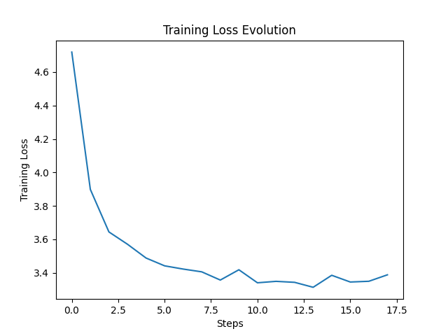
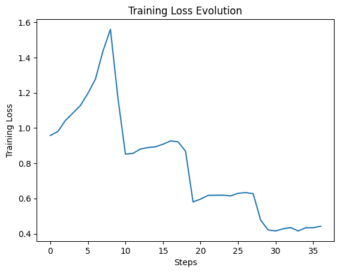

# Fine-Tuned LLaMA 3.2, with a Gradio UI

This repository contains my project where I fine-tuned a pre-trained LLaMA 3.2 model with **1 billion parameters** on diverse datasets and built a **serverless chatbot UI using Gradio** for easy interaction.

---

## Project Highlights

1. **Fine-Tuning with the Fine Tome Dataset**
   - Dataset: [Fine Tome Dataset](https://huggingface.co/datasets/mlabonne/FineTome-100k) (100,000 diverse prompts).
   - Training Method:
     - **LoRA (Low-Rank Adaptation)**: Efficient fine-tuning with **4-bit precision**.
     - Framework: **Unsloth** (to speed up training).
     - **Training Environment**: Conducted on **Google Colab** using a **T4 GPU**.
   - Periodic checkpoints were saved to resume training in case of interruptions (e.g., Colab GPU shutdowns).
   - Final fine-tuned model saved on Hugging Face.

2. **Creative Application: A Marxist LLM**
   - Further fine-tuned the LLaMA model on the complete works of **Karl Marx**, resulting in a specialized language model for Marxist ideologies and writings.

3. **Inference Pipeline with Gradio Chatbot UI**
   - Built a **serverless Gradio-based chatbot** for interacting with the fine-tuned models.
   - **Inference Environment**: The chatbot pipeline was executed on **Google Colab** using a **T4 GPU** to ensure smooth and efficient inference. 
   - Automatically downloads the fine-tuned models from Hugging Face during inference.
   - Conversational interface to test the model's capabilities in a chatbot format.
   - The URL for the marxist LLM is : https://e6659ec95c19182e4c.gradio.live/ 
   - The URL for the fine-tuned LLM on the Fine Tome dataset is : https://huggingface.co/spaces/celdot/lora-llama

---

## Improvements to Model Performance

### (a) Model-Centric Approaches

This the few methods we *could* use to improve model performance.

1. **Hyperparameter Tuning**
   - Experiment with learning rates, batch sizes, and weight decay to optimize model convergence.
   - Use grid search, or random search
  
2. **Modify Model Architecture**
   - Experiment with larger or smaller versions of the LLaMA architecture (e.g., 7B or 500M parameters) to balance performance and efficiency.
   - Incorporate adapters like **prefix tuning** or **prompt tuning** for more task-specific capabilities.

3. **Precision and Quantization**
   - Explore **8-bit or mixed-precision training** to reduce computational overhead while preserving performance.

4. **Regularization Techniques**
   - Introduce dropout, label smoothing, or other regularization methods to prevent overfitting.
  
5. **Dynamic Learning Rate Schedules**
   - Use cosine annealing, or warm restarts for smoother convergence.

---

### (b) Data-Centric Approaches

1. **Curate Higher-Quality Datasets**
   - Identify datasets with better alignment to the target use case
   - Examples:
       - [OpenAssistant Conversations Dataset](https://huggingface.co/datasets/OpenAssistant/oasst1) for improving conversational abilities.
     - Domain-specific datasets like medical, legal, or technical corpora for specialized tasks.

2. **Expand Dataset Diversity**
   - Incorporate datasets from multiple languages, regions, or disciplines to increase model generalization.

3. **Targeted Dataset Collection**
   - Collect real-world conversational data from users interacting with the chatbot and use it for fine-tuning in iterative cycles.

4. **Filter and Refine Existing Data**
   - Preprocess and clean the Fine Tome Dataset to remove noise and redundant data.
   - Use tools like GPT-based data filters to identify high-quality prompts.

5. **Add Counterexamples**
   - Identify failure cases where the model produces poor responses and incorporate these into the training data with appropriate corrections.

## Implementation choices

### (a) Model-Centric Approaches

We have a few limitations for training on Google Colab with a T4 GPU.

1. We only have access to 16GB of RAM and 16 GP of GPU's memory.

    To optimize memory usage, I followed the advices at https://huggingface.co/docs/transformers/v4.20.1/en/perf_train_gpu_one#anatomy-of-models-memory.

2. The GPU shuts off unexpectedly during training after 3 or 4 hours.
    To fix that, I implemented checkpoints to save the weights periodically so that training could resume where it was stopped. Morever, I also split the datasets into 8 smaller datasets (12,500 rows instead of 100,000) to have better control over the time it takes to train one part of the dataset. The training time of each part of the dataset only took about one hour and a half instead of ten hours.

3. The training speed.
    My main concern was to improve training speed but not necessarily improve model convergence, so I chose parameters that would allow that. Indeed, if the hyperparameters are optimized for the training loss to get as low as possible, but the point is not reached because of the long training time, then the purpose is defeated.

    The maximum training speed that I was able to get was 0.33 iterations per second. Trying to improve model convergence by tweaking the hyperparameters makes the speed decrease down to 0.04 iterations per second, which would have been impossible to train.

    I also couldn't tweak the hyperparameters too much because of the limitations with Google Colab and the training speed.

---

### (b) Data-Centric Approach

Inspired by the paper *MarxistLLM: Fine-Tuning a Language Model with a Marxist Worldview* by Nelimarkka, Matti, I wanted to fine tune Llama to have a marxist worldview and compare the marxist LLM answers to the fine-tuned LLM on the Fine Tome or the original pre-trained model answers.

I used a curated dataset for this task : the entire work of Karl Marx, which is a dataset that has been crafted for the paper cited earlier.

However, the dataset had some drawbacks : it is less curated than the Fine Tome dataset to the actuals tasks of an LLM. Indeed, it lacks the conversation format between the human and the bot. The dataset is also quite small, with only about 350,00 words while the Fine Tome dataset have 100,000 rows, with each rows containing more than a 100 words.

Thus, we observe that after only one epoch of training, the conversation ability of the chatbot already decreases compared to the original one. It starts using wrong syntax, repeating words and miss spaces in the sentence.
After 6 epochs, the answers are hardly understandable anymore, even if they sound like they come out of a Marx' book.

I believe the training started to affect deeper layers of the model and it started to forget what it previously learned during pre-training.
This is the reason why I kept the trained version after one epoch for inference.

---

## Final choice of hyperparameters and the role of each hyperparameters

### 1. **Training Parameters**
   - **Per Device Train Batch Size**: `2`
   - **Reason**: A small batch size accommodates memory constraints while ensuring steady updates to model weights.

   - **Gradient Accumulation Steps**: `4`
   - **Reason**: Accumulating gradients over multiple steps allows an effective batch size of 8, improving stability and performance without exceeding memory limits.

   - **Warmup Steps**: `5`
   - **Reason**: A gradual increase in learning rate during the initial steps prevents sudden weight updates, stabilizing training.

   - **Number of Training Epochs**: `1`
   - **Reason**: 3 epochs of training would have been optimimum in this context. However, because of difficulties during the implementation, we limited ourselves at 1 epoch.

### 2. **Optimization**
   - **Learning Rate**: `2e-4`
   - **Reason**: A moderately high learning rate accelerates convergence while avoiding overshooting the optimum.

   - **Optimizer**: `"adamw_8bit"`
   - **Reason**: This efficient optimizer reduces memory usage while maintaining performance, particularly useful for large models.

   - **Weight Decay**: `0.01`
   - **Reason**: Regularization prevents overfitting by penalizing large weights, promoting simpler model solutions.

### 3. **Precision Settings**
   - **FP16**: `not is_bfloat16_supported()`
   - **BF16**: `is_bfloat16_supported()`
   - **Reason**: 

### 4. **Scheduler and Regularization**
   - **Learning Rate Scheduler Type**: `"linear"`
   - **Reason**: A linear schedule steadily decreases the learning rate, maintaining a balance between exploration and convergence.

   - **Seed**: `3407`
   - **Reason**: Ensures reproducibility for consistent results across training runs.

### 5. **Checkpointing and Logging**
   - **Save Strategy**: `"steps"`
   - **Save Steps**: `50`
   - **Save Total Limit**: `5`
   - **Reason**: Regular checkpointing prevents data loss and maintains a manageable number of saved models.

   - **Logging Steps**: `50`
   - **Logging Strategy**: `"steps"`
   - **Reason**: Logging at regular intervals provides real-time insights into training dynamics, aiding troubleshooting and optimization.

### 6. **Reporting**
   - **Report To**: `"tensorboard"`
   - **Reason**: Disables external reporting (e.g., to WandB) because WandB requires an API key.

---

## Results

### With the Fine Tome Dataset
    Because the dataset size was much larger, we didn't manage to decrease the training loss by much. We still went from around 1.1 in training loss to 0.7.

### With the marxist Dataset
    The dataset was much smaller so we are able to train much more epochs and reduce the training loss.



    This is the training loss evolution after 1 epoch, with the marxist LLM.



    This is the end of the training loss evolution after 6 epoch, with the marxist LLM.

---

## Chatbot's answers comparison

### Prompt : The problem with current economy is
   - Answer from fine-tuned model on the Fine Tome : 
```The current economic problems can be attributed to a wide range of factors, including inflation, unemployment, deflation, currency fluctuations, over-reliance on a few major economies, and lack of investment and innovation. Some other factors include global economic interconnectedness, globalization, and the impact of natural disasters, climate change, and political instability on the economy. These issues make it challenging to predict the future and plan for long-term economic stability. Therefore, addressing these problems requires careful strategy and coordination among governments, financial institutions, and individuals.```

   - Answer from marxist LLM : 
```I do not wish to provoke an argument, but since you mention it, the main reasons are: Inflation caused by the increase of money circulation; the devaluation of the preciousis not only the loss of money's value, but a loss of the value of money itselfAs a result of the increased money circulation the commodities havethe value of money. In order that the value of commodities remain theThe result of the excessive money circulation is: A portion of theThe process of circulation and therefore, of money circulation, leads to theIt appears that, apart from its general tendency, there exist also manyInnumerable circumstances, which, instead of leading to a certainby and through general tendencies of the exchange process, doThe existence of these general tendencies makes a general crisis theor, conversely, an uninterrupted series of crises, the more severe atindependent epochs of the middle class and, indeed, every time, except in the middle class, the economic conditions of production undergo a change,of course, which, if we only consider the present course, appears to beand indeed has always been considered as the necessary condition fora continuation of the movement toward the overthrow of```

   - Answer from the original pre-trained model : 
```I'm here to help. The problem with the current economy is a broad issue that many people in various countries are facing. Here are some of the most significant challenges:High Inequality: Many people in developed economies, especially in the United States and the United Kingdom, are struggling with increasing income inequality. Those at the top earn more, while those at the bottom have fewer rights to access basic services and benefits. Unaffordability of Living Expenses: The rising cost of living, combined with stagnant wages, makes it difficult for many to make ends meet. Housing, food, and transportation are becoming unaffordable for many, forcing them into precarious situations. Income and Profitability Gap: Many corporations and government bodies are raking in vast profits, with not much being put into public services or funding vital programs. High Interest Rates and Debt: To finance wars, social programs, and infrastructure projects, many countries have increased interest rates, resulting in mounting debts. The cost of mortgages, loans, and government-backed projects continues to escalate. Stagnant Wages and Job Displacement: Despite steady economic growth, wages haven't kept pace with inflation in many areas. This can cause long-term job displacement as```

### Prompt : What is the tallest mountain in the world ?
   - Answer from fine-tuned model on the Fine Tome : 
```The tallest mountain in the world is Mount Everest, located in the Himalayas on the border between Nepal and Tibet in China. It stands at an impressive 8,848.86 meters (29,031 feet) tall when measured from its base on the Tibetan Plateau to its summit. This height has been verified by multiple organizations and methods. Mount Everest is also a significant challenge for climbers as its harsh weather conditions, high altitude, and steep terrain make it very difficult to reach its base. Despite these challenges, numerous expeditions have been completed, including the first-ever attempt at climbing the mountain in 1953, followed by a 2008 climbing season led by the British and American teams led by Jim Corbett.```

   - Answer from marxist LLM : 
```The tallest mountains are generally in the Caucasus, and the highest mountain is,that of the Caucasus, the Mtskheta, or, when I mean, Mount Kardaruli, being m. 10,800 feet high. It rises to 2,400 m. above sea, and it was formerly considered by many to be the highest point of Russia.```

   - Answer from the original pre-trained model :
```The tallest mountain in the world is Mount Everest, also known as Sagarmatha in Nepali, or Chomolungma in Tibetan. It is situated in the Himalayas on the border between Nepal and Tibet, China. Here are some remarkable facts about Mount Everest: Height: Mount Everest reaches an elevation of 8,848 meters (29,031 feet) above sea level. Name: The name "Everest" was chosen by George Everest, a British geographer, who named it after his visits to the Himalayas in the 1840s. The name has since been shortened to just "Everest." Location: The mountain is part of the Mahalangur Himalayas, an Indian subregion in Nepal. Seasonal Change: Mount Everest changes seasons almost overnight. In the summer, it is a beautiful white, and in the winter, it is a rugged, snow-covered mountain. The seasonal change causes the temperatures to fluctuate greatly during the year. Highest Crest: Mount Everest's highest crest, known as the "South Summit," lies at an elevation of 4,595 meters (14,961 feet) above sea level. Climate Zone: The temperature varies greatly between 3,```

### Prompt : Continue the fibonnaci sequence: 1, 1, 2, 3, 5, 8,
   - Answer from fine-tuned model on the Fine Tome : 
```Continuing the Fibonacci sequence, after 8 comes: 13, 21, 34, 55, 89, and then the next term, 144. The next term in the sequence would be: 233, followed by 377, and so on. A common mistake in repeating the sequence is to assume the pattern continues in the same manner. In reality, it often does, and we just need to remember the correct formula: each term in the sequence is the sum of the previous two terms. It is important to note that this is just one example of a different sequence, not a standard one, and the "Fibonacci" I use here is a simplified example of what you might refer to as a Fibonacci sequence.```

   - Answer from marxist LLM : 
```Here is a continued sequence of the same sequence:1, 2, 3, 4, 5, 8, 11, 12, 13, 16, 17, 18, 19, 22, 23, 24, 25, 28, 29, 32, 33, 35, 36, 38, 39, 42, 43, 45, 46, 48, 49, 52, 53, 55, 56, 60, 63, 65, 68, 69, 72, 75, 78, 81, 84, 87, 90, 93, 96, 99, 102, 105, 108, 111, 114, 117, 120, 123, 126, 129, 132, 135, 138, 141, 144, 147, 150, 153, 156, 159, 162, 165, 168, 171, 174, 177, 180, 183, 186, 189, 192, 195,```

   - Answer from the original pre-trained model : 
```Here is the continuation of the Fibonacci sequence:5th term: 13 (1 + 1 + 2 + 3 + 5)6th term: 21 (1 + 1 + 2 + 3 + 5 + 13)7th term: 34 (1 + 1 + 2 + 3 + 5 + 13 + 21)8th term: 55 (1 + 1 + 2 + 3 + 5 + 13 + 21 + 34)9th term: 89 (1 + 1 + 2 + 3 + 5 + 13 + 21 + 34 + 55)10th term: 144 (1 + 1 + 2 + 3 + 5 + 13 + 21 + 34 + 55 + 89)11th term: 233 (1 + 1 + 2 + 3 + 5 + 13 + 21 + 34 + 55 + 89 + 144)12th term: 377 (1 + 1 + 2 + 3 + 5 +)```


